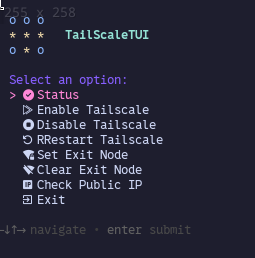

# TailScaleTUI

A simple Text User Interface (TUI) for managing your Tailscale connection using Bash and Gum.

Control Tailscale status, enable/disable, set exit nodes, and check your public IP address from a convenient terminal interface.

 o o o
 * * *   TailScaleTUI
 o * o

## ss 




## Features

*   View Tailscale status (online/offline peers, active exit node).
*   Search within the status list.
*   Enable your Tailscale connection (`tailscale up`).
*   Disable your Tailscale connection (`tailscale down`).
*   Restart Tailscale (`tailscale down && tailscale up`).
*   Select and set an available Exit Node.
*   Clear the currently set Exit Node.
*   Check your current public IP address (using `ipinfo.io`).

## Dependencies

This script relies on the following command-line tools:

*   `tailscale`: The Tailscale CLI tool itself.
*   `gum`: A tool for making glamorous shell scripts (used for interactive prompts, spinners, etc.).
*   `jq` (Optional): Required for pretty-printing JSON output when checking your public IP. The script will work without it, but the IP info display will be plain text.
*   Standard utilities: `curl`, `grep`, `sed`, `awk`, `tput`, `fold`. These are typically pre-installed on most Linux distributions.

## Installation

1.  **Clone the Repository:**
    ```bash
    git clone https://github.com/aptdnfapt/tailscaletui.git
    cd tailscaletui
    ```

2.  **Make the script executable:**
    ```bash
    chmod +x tailscale.tui
    ```
    *(Note: The script file is assumed to be named `tailscale.tui` based on common practice and repository structure, even if the project name is "TAILSCALE TUI")*

3.  **Install Dependencies:**

    Install `tailscale` first, then `gum` and `jq`. The other dependencies are usually standard.

    **For Fedora:**
    ```bash
    sudo dnf install tailscale gum jq
    ```

    **For Arch Linux:**
    ```bash
    sudo pacman -S tailscale gum jq
    ```

    **For Ubuntu / Debian:**
    First, install Tailscale using their recommended script:
    ```bash
    curl -fsSL https://tailscale.com/install.sh | sh
    ```
    Then, install Gum and Jq:
    ```bash
    sudo apt update
    sudo apt install gum jq
    ```

## How to Run

Navigate to the directory where you cloned the script and run:

```bash
mv ./tailscale.tui ~/.local/bin/
tailscale.tui


